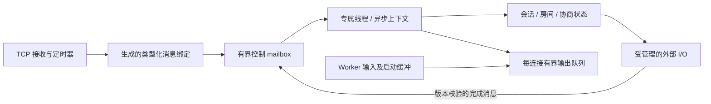

# Server / Relay actor 架构

Server 和 Relay 每个进程各拥有一个 `ControlPlaneActor`。每个实例拥有独立线程及
`ActorSynchronizationContext`；正常 `await` 后回到同一线程。mailbox 中的一个命令完全
结束后才执行下一个命令，等待期间不会执行其他业务命令。Managers 是这个 actor 的状态模块。
会话、房间、P2P 协商与 Relay 注册之间的状态变更在同一 turn 内完成。

## 状态归属

| 组件 | 归属与职责 |
| --- | --- |
| `ActorTcpListener` / `SessionAdmission` | socket 接受、登录等待、对准确连接的一次性 promotion；状态经控制 mailbox 修改 |
| `ClientManager` | 已注册会话、单调时钟心跳、幂等断开、同步通知状态模块 |
| `GroupManager` | 用户、房间、短 ID、异步操作版本；对外返回房间快照 |
| `P2PManager` | 请求身份与协商状态；30 秒过期，每用户 256、全局 4096 个待处理请求 |
| `RelayServerManager` / `RelayLoadManager` | 原子注册 Relay 地址、只接受已注册 Relay 的负载 |
| `InterconnectServerManager` | 可信互联节点、查询时捕获连接与注册信息快照 |
| `RelayManager` | 权威房间映射、Data/Worker 连接、替代连接清理、待完成握手 |
| `SessionTransportHub` / `SessionOutbox` | 线程安全的 I/O 边界；每连接串行输出，隔离慢连接 |
| `RelayWorkerInput` | 每 Worker 的有界首帧缓冲及目标发布；控制 actor 决定路由，I/O 回调只转发字节 |

所有业务集合都是普通 `Dictionary` / `List`，由控制 actor 独占。跨线程同步只存在于
transport、dispatcher 注册表与持久化服务的输入边界。`AssertAccess()` 同时检查线程、
上下文及 turn 状态；不能在外部调用状态模块，也不能在 actor 内 `AskAsync` 自己。



## 消息绑定与源生成器

状态处理方法标注 `[ActorMessage]`，所在类声明为 `partial`，构造函数调用
`RegisterActorHandlers(dispatcher, actor)`。增量生成器生成：

- 每个消息的具体 command 类型，直接调用 `void` 或 `Task` 处理方法；没有反射调用。
- dispatcher callback 只尝试入队；mailbox 已满或关闭时关闭来源连接。
- 按准确 `HandlerId` 注销的 `Dispose` 实现；BackgroundService 调用基类 Dispose。
- 对非法方法签名或非 partial owner 给出 `CXACT001` 编译错误。

现有包注册生成器也改为 `ForAttributeWithMetadataName`，按类型名排序、去重，保持
MemoryPack 具体 formatter 的 AOT 注册。消息字段与协议版本保持兼容。

Server / Relay 使用 `ActorDispatcher`：一次性响应绑定准确连接，重复响应与取消使用
`TrySetResult` / `TrySetCanceled`。现有请求协议没有 correlation ID，因此同一连接的
`SendAndListenOnce` 请求串行执行。单独调用 `SendAsync` 仍须由调用方维护请求/响应关系。
客户端项目的 dispatcher 注册保持原样。

## 时序

1. listener 先完成 bind / listen，再开始可取消的接受循环。新连接先绑定解码，再通过
   mailbox 登记，之后启动受管理的会话读写循环。
2. 登录及 Relay 握手只能由准确的待登录连接完成一次。先建立状态，再排入成功响应。
3. Relay 客户端与主服务器走不同 TCP 连接。权威映射尚未抵达时，最多保留 1024 个握手，
   等待 5 秒；收到映射后继续校验。已经明确不匹配的房间直接拒绝。
4. Worker 的确认先进入其连接输出队列，再启用双向路由。先抵达的原始数据进入有界缓冲；
   目标发布与缓冲释放在 I/O 边界原子执行，避免首帧丢失或后帧超越。
5. Data 连接替代会清理旧连接及双方 Worker。旧连接的迟到断开不能删除替代连接。
   离房、踢出与解散均移除相应路由；解散清理该房间所有成员。
6. 超时、主动退出与 socket 断开共用幂等 detach 路径，先移除会话再同步通知状态模块。

## 外部 I/O 与停机

ZeroTier 建网与跨服务器查询不阻塞控制 mailbox。actor 保存操作版本及必要快照，
最多同时执行 32 个外部操作，网络创建/删除超时 30 秒；完成后发送消息回 actor。
重新验证用户、连接、操作版本及房间归属。已断开用户的迟到建网结果会被回收。
删除失败或外部容量耗尽记录日志；没有持久化删除重试队列。

控制 mailbox 容量为 4096。每连接输出队列以及 Worker 启动缓冲最多各保留 128 帧；
输出超时 5 秒。超载会关闭连接，不在网络回调中创建无限等待的 Task。
容量是条目上限，内存占用仍取决于帧大小和连接数。

控制 actor 最先注册为 hosted service，最后停止。其他 hosted services 先停止网络入口与
定时器、清理 actor 内状态；随后 actor 取消 I/O，等待外部操作、会话及输出任务，封闭并
排空 mailbox，退出其线程。外部任务不能捕获业务集合并直接修改它们。

新增独立 actor 时必须拥有自己的 mailbox 与 `ActorSynchronizationContext`，跨 actor
通信只能使用消息和快照。不要共享 Managers 的可变对象，也不要用 `ConfigureAwait(false)`
绕过 actor 上下文后继续修改状态。专属线程成本按 actor 实例计算，目前每进程一个控制 actor。

## 验证

```sh
dotnet test ConnectX.Tests/ConnectX.Tests.csproj -c Release
dotnet build ConnectX.slnx -c Release
```

测试覆盖 await 的线程/上下文保持、不同实例隔离、不交错、满载拒绝、生成绑定生命周期、
生成器诊断与确定性、请求响应隔离与串行化、慢连接隔离、登录 promotion、Relay 权限与
连接替代、映射先后抵达、Worker 首帧顺序、迟到建网回收，以及真实 TCP 登录、建/入/退房、
数据报、Worker 字节转发和完整停机。真实 TCP 测试使用本地动态端口，ZeroTier I/O 使用可控
测试替身；没有声称验证了真实 ZeroTier 控制器或生产负载性能。

设计参考：[.NET Channels](https://learn.microsoft.com/en-us/dotnet/core/extensions/channels)、
[Roslyn 增量生成器指南](https://github.com/dotnet/roslyn/blob/main/docs/features/incremental-generators.cookbook.md)。
